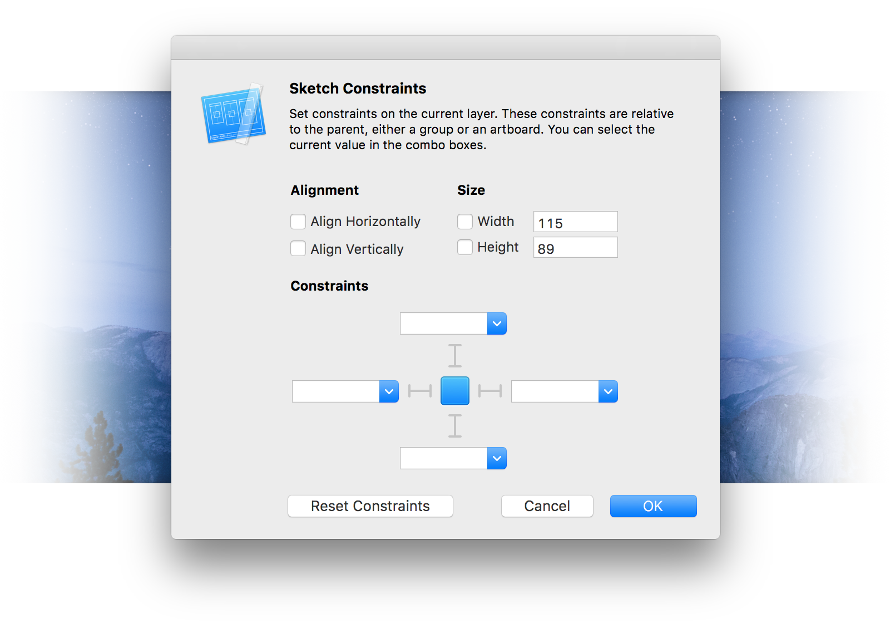
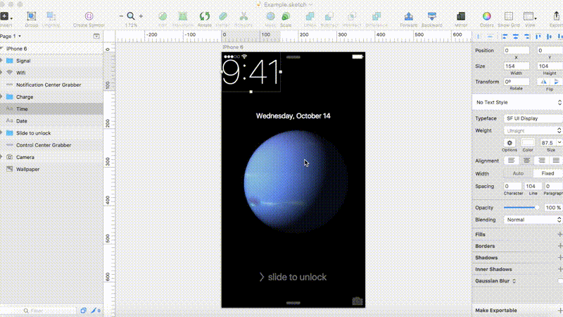
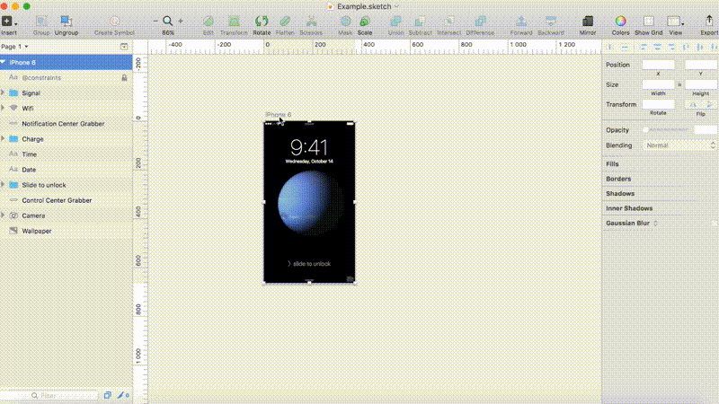
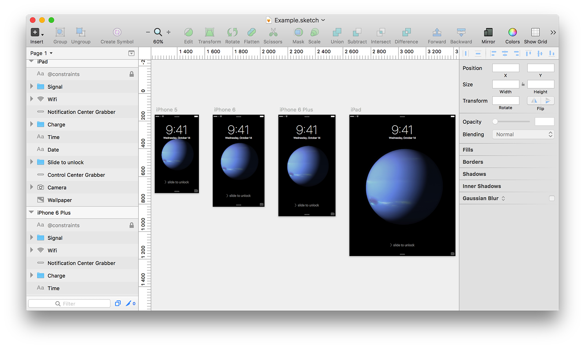

# Sketch Constraints

Sketch Constraints is a plugin that integrates constraints in Sketch to lay out layers. These constraints are relative to the parent, either a group or an artboard, and they are linked to layer names, so every layer with the same name will have the same constraints applied to it.

## Usage

### Edit Constraints `⌘ + E`

### Update Layout `⌘ + L`

### Example

## Installation

Make sure you have the latest version of Sketch 3 installed. **(Sketch 3.3+)**

1. [Download the ZIP file of this repository](https://github.com/bouchenoiremarc/Sketch-Constraints/archive/master.zip)
2. Double click on `Sketch Constraints.sketchplugin`

## Notes

1. **Constraints are not relative to other layers, only to the parent.**
2. `Update Layout` updates every artboard of the current page.
3. When a group is resized, all the children layers are resized. If you want a child layer to keep its size, check `Width` and/or `Height`.
3. *Currently, constraints are linked to layer names. Linking them to layer IDs wasn't a better solution because it would stop working for duplicated artboards and layers. If you know how to improve this, ping me on [Twitter](https://twitter.com/bouchenoiremarc) or [create an issue](https://github.com/bouchenoiremarc/Sketch-Constraints/issues).*

## License

Sketch Constraints is released under the MIT license. See [LICENSE](LICENSE) for details.